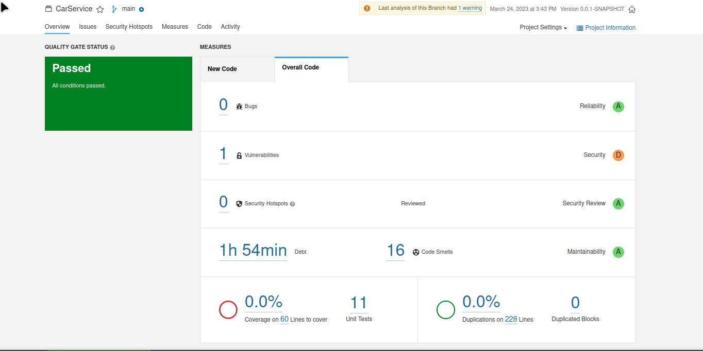
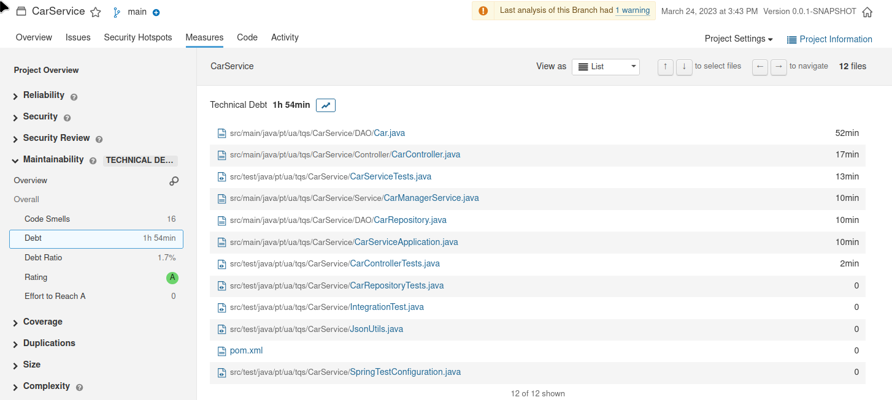
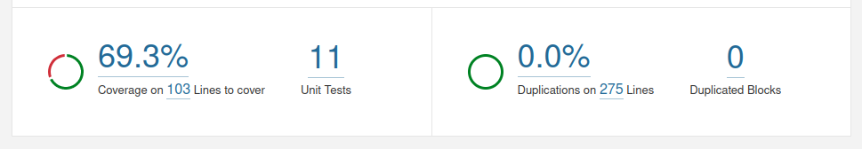
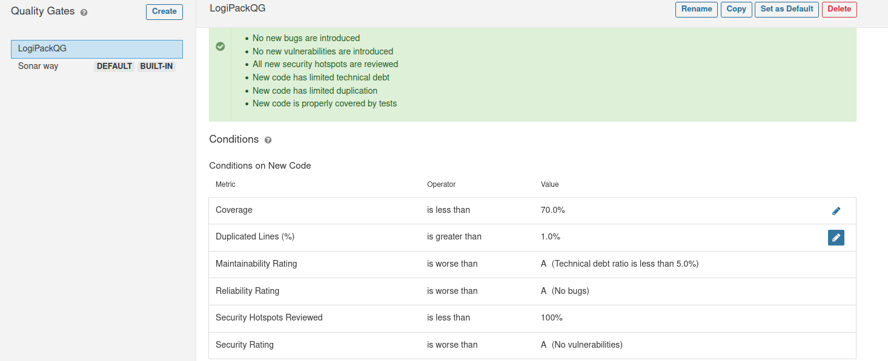

# Lab6 ex1

### To run the SonarCube local instance use the docker command bellow
```
docker run -d --name sonarqube -e SONAR_ES_BOOTSTRAP_CHECKS_DISABLE=true -p 9000:9000 sonarqube:latest
```

### password to sonarcube local instance
```
admin
adminroot
```

### the SonarCube Token for euromillions project
```
sqp_3facc79ec8f72f16796d93023bb963767f8b1e02
```

### to verify a project using the sonarCube
```
mvn verify sonar:sonar -Dsonar.host.url=http://localhost:9000 -Dsonar.projectKey=euromillions -Dsonar.login=sqp_e36b85c2f6264c14312d00141b1fb0e96d7b902d
```

## Exercise 1.g)

|Issue|Problem description|How to solve|
|----|------|----|
|Bug|0 bugs||
|Vulnerability|0 vulnerabilities||
|Security Hotspots|Make sure that using this pseudorandom number generator is safe here. Using pseudorandom number generators (PRNGs) is security-sensitive|Don't ever use Math.random for any cryptographic needs. Use the SecureRandom class instead.|
|Code Smell (major)|Invoke method(s) only conditionally.|From my understanding the issue is that, it's a waste of computation if we are to execute certain methods only to show them on the logger, when this may or may no be active. A better approach would be make sure the logger is enabled. <br> **The correct way:** <br >if(log.isInfoEnabled()){ <br> log.info("Betting with three random bets \n{} ", myBet.format());<br>} <br>|
|Code Smell (major)|Refactor the code in order to not assign to this loop counter from within the loop body.|It's not a good idea to change the value of the for loop control variable from within the loop. We should either use a While loop or in this case just we can also just increment the value in the for loop declaration. <br>**Wrong way:**<br>        for (int i = 0; i < STARS_REQUIRED; ) { <br>// some code here<br>i++}; <br><br> **A Better Way:** <br> int i = 0;<br> while ( i < STARS_REQUIRED; ) { <br>// some code here<br>i++; <br>}|
|Code Smell (major)|Remove this 'public' modifier.|JUnit5 test classes and methods should have default package visibility; <br> <br>In this context, JUnit5 test classes can have any visibility but private, however, it is recommended to use the default package visibility, which improves readability of code.<br><br> We can just remove the public from the test classes|


# ex2 

### token for Car Service project
```
sqp_a93485df4df1f268c7c536107d72a7daf6cdc912
```
### a)





**From the SonarCube Documentation**

**Technical debt**: A measure of effort to fix all code smells. The measure is stored in minutes in the database.

**Technical debt on new code**: a measure of effort required to fix all code smells raised for the first time on new code.

**Technical debt ratio**: The ratio between the cost to develop the software and the cost to fix it. The Technical Debt Ratio formula is: Remediation cost / Development cost
Which can be restated as: Remediation cost / (Cost to develop 1 line of code * Number of lines of code)
The value of the cost to develop a line of code is 0.06 days.

**Technical debt ratio on new code**: The ratio between the cost to develop the code changed on new code and the cost of the issues linked to it.


### b) two major code smells.
*   **Incrementing a static value in the constructor** - to solve this I intruduced an IdProvider following the Singleton Design Pattern
* **Persistent entities should not be used as arguments** - I created a DTO (Data transfer object) object


### d) Code Coverage




# ex3 - LogiPack

**token**
```
sqp_8c23df30a7d27136af41fb54d15527a7293fc3f4
```

## Quality Gate for LogiPack




